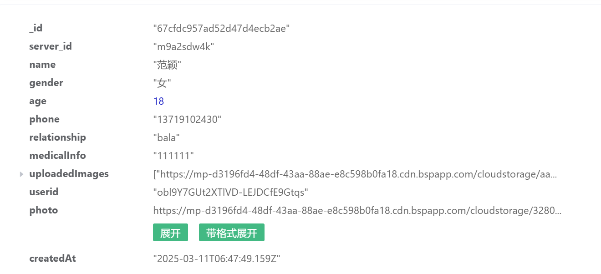
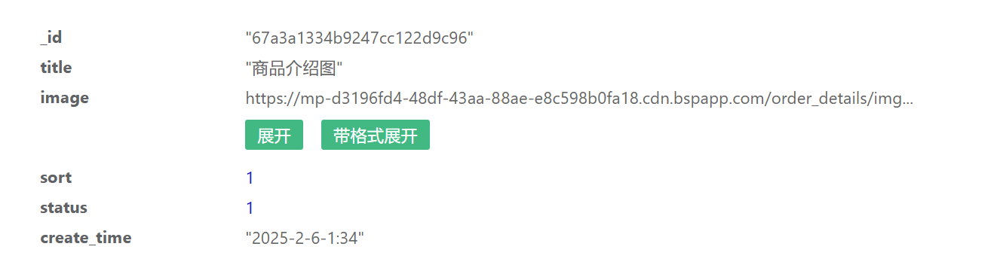

# e陪无忧

## 订单部分

### 数据库设计

#### server_object表（陪诊人表）

该表用于存储陪诊人消息，server_id是随机生成的关于陪诊人的编号，userid是当前登录对象的open_id，photo是陪诊人照片的地址，uploadedImages是用户上传的关于陪诊人健康信息的照片。medicalInfo是关于陪诊人健康信息的文字描述。后续可能细分为既往病史、药物过敏与近期检查报告。

#### order_details表（商品详情表）

设计比较粗糙，属于是初期实验产品。后面可能要重新设计，主要用于存放不同陪诊服务商品详情页的信息和图片。

### 待实现的部分

#### 陪诊人健康档案展示

在用户为陪诊人填写了基础信息与过往病史信息后，生成一份陪诊人健康档案展示数据。目前需要制作前端，大致展示的信息就是在server_object表中的信息以及根据用户的数据智能为用户推荐一些医疗器械与医疗建议。

#### 确认订单后的页面

目前ui设计如上，展示客户关于陪诊的基本信息：时间、要求、电话、以及挂号需求（挂号需求的实现与否需要陪诊师电联客户进行下一步沟通）。

目前想的是订单会有一个订单表：
用户点击确认后15（30）分钟未支付，状态是“待支付”，订单会被取消，状态改为“取消”;反之，支付成功后，状态改为“确认”,服务完成后，状态改为“完成”。

（1）allOrder表

_id 主键
serviceId 陪诊服务Id
serverId 陪诊人Id
userId 用户Id
escortId 陪诊师Id
serverTime 陪诊时间
order_status 订单状态（待支付、确认、取消、完成）
server_status 服务状态（未开始、开始、结束）
server_record 消费记录

（2）order_detail订单表
_id 主键
serviceId 陪诊服务Id
serverId 陪诊人Id
escortId 陪诊师Id
serverHospital 就诊医院
serverTime 就诊时间
department 科室
upload_image 上传资料
server_demand 陪诊人需求
is_register 是否需要挂号
register_demand 挂号要求

#### 为客户发送信息及时确认陪诊进程

陪诊师到医院打卡（打开定位或拍照），上传平台（点“服务开始”），平台标记“服务开始”，并且开始跟踪，子女端会收到“陪诊服务已开始”的提示。陪诊结束后，陪诊师点“服务结束”，并上传相关资料或想说的话。子女方/患者方会收到一条短信“今日陪诊服务已结束，所有陪诊资料、注意事项已在小程序”。
